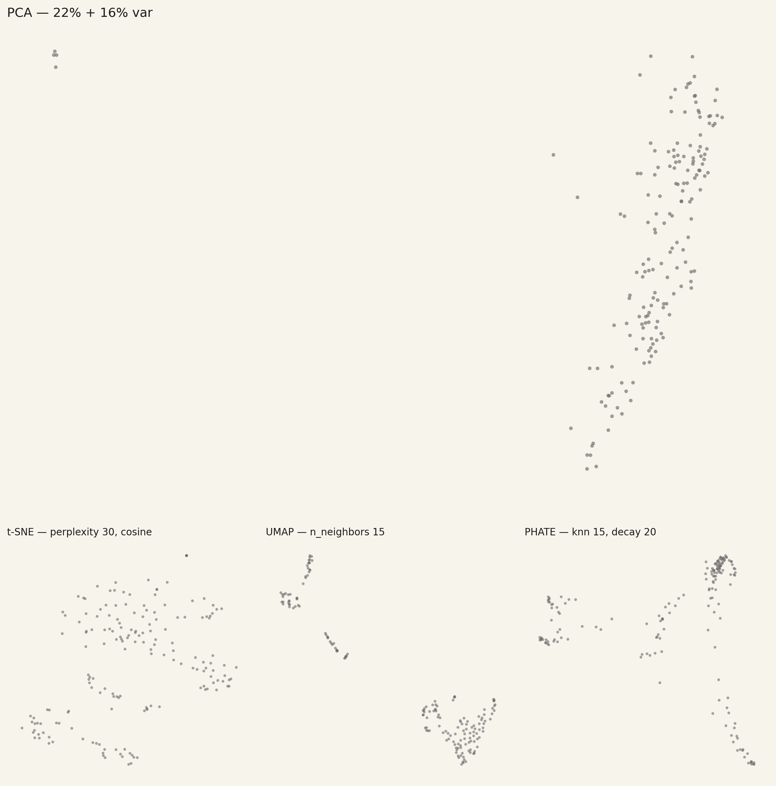
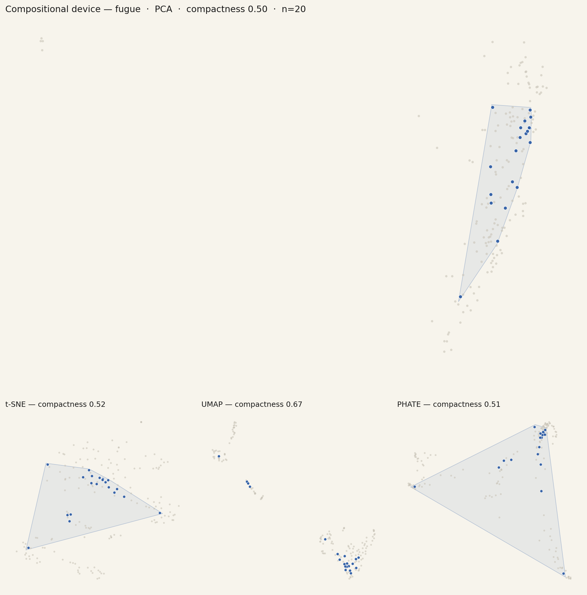
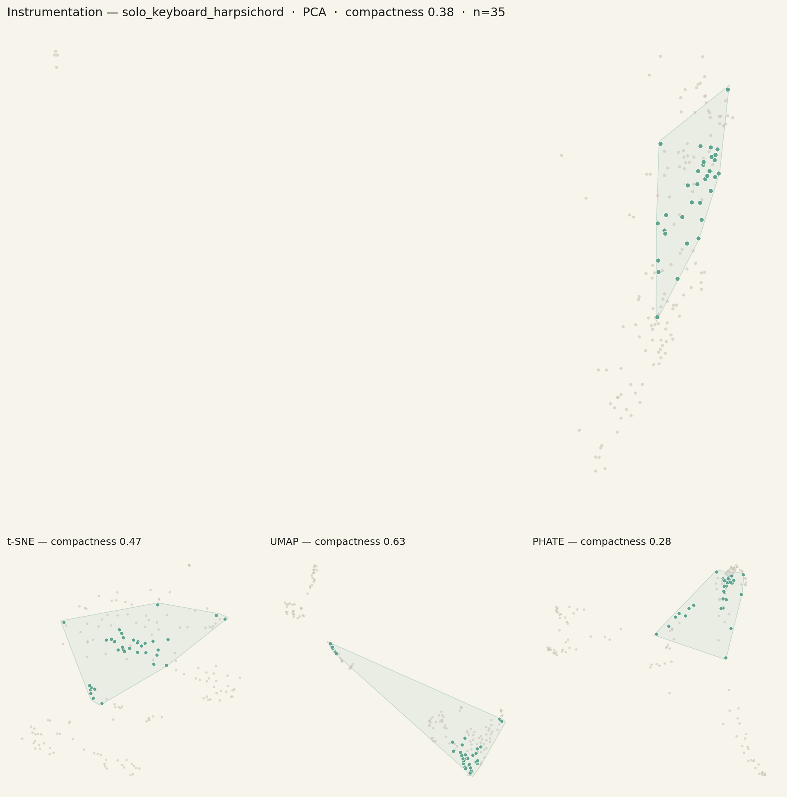
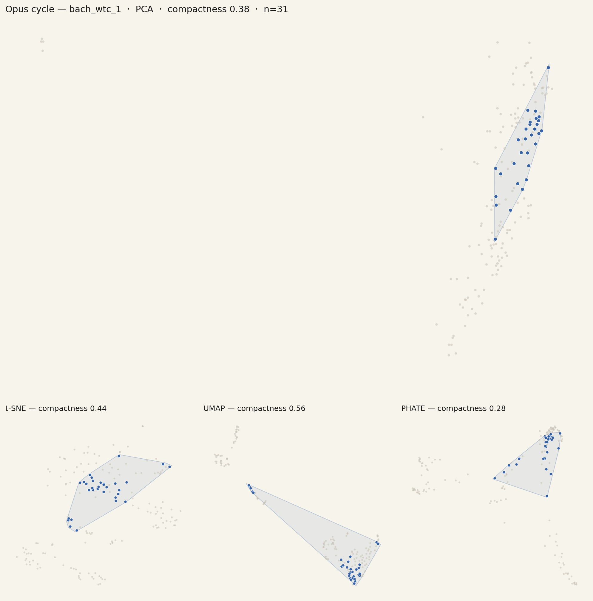
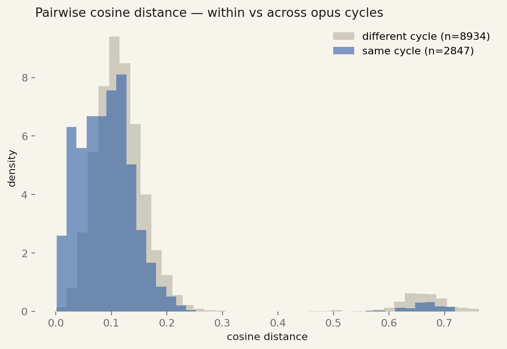
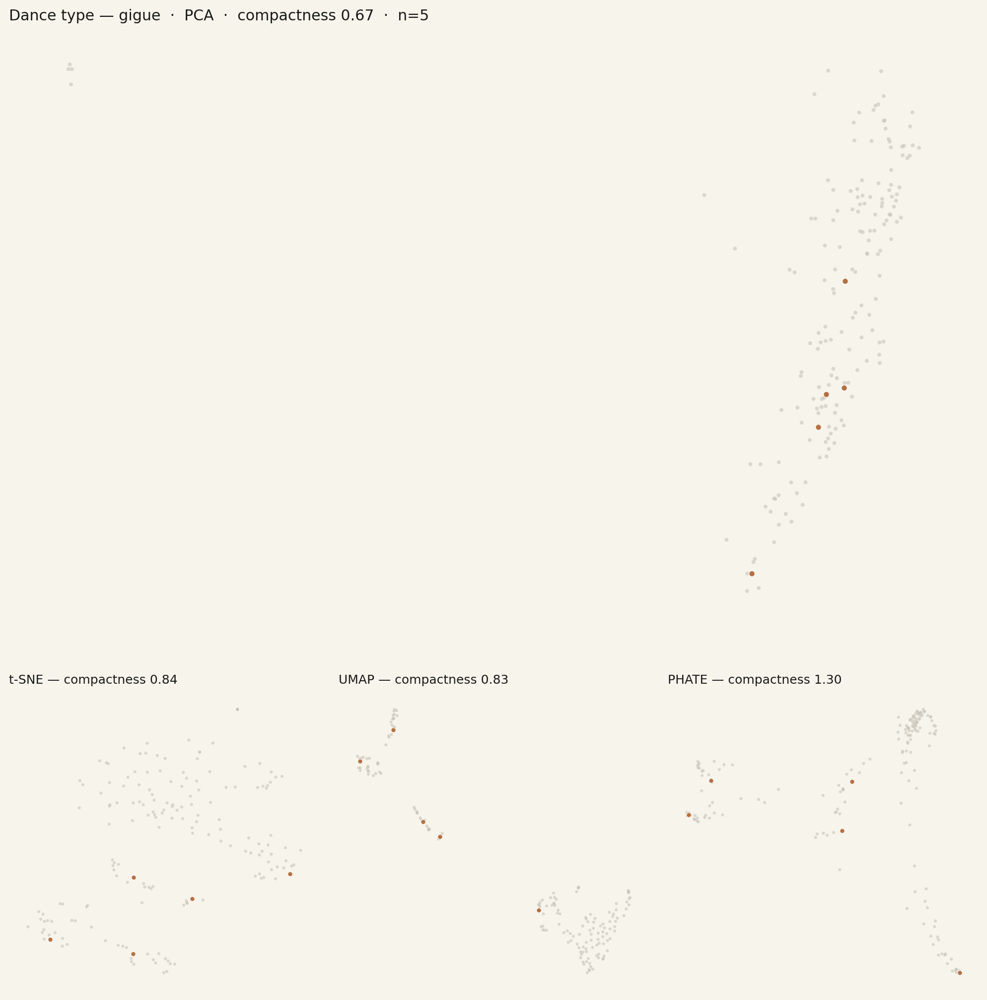
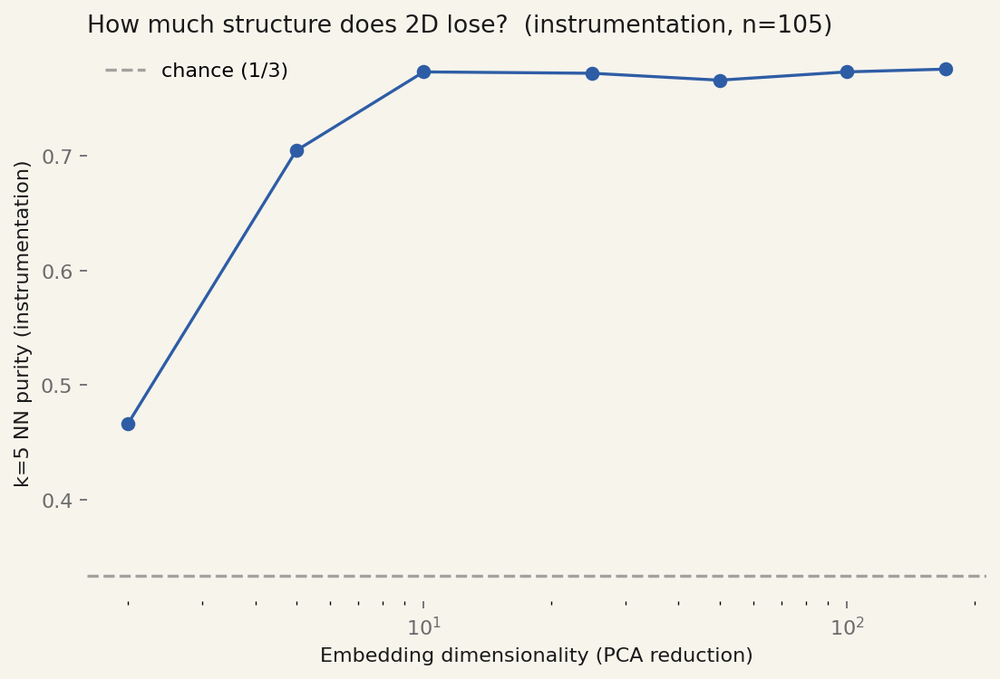
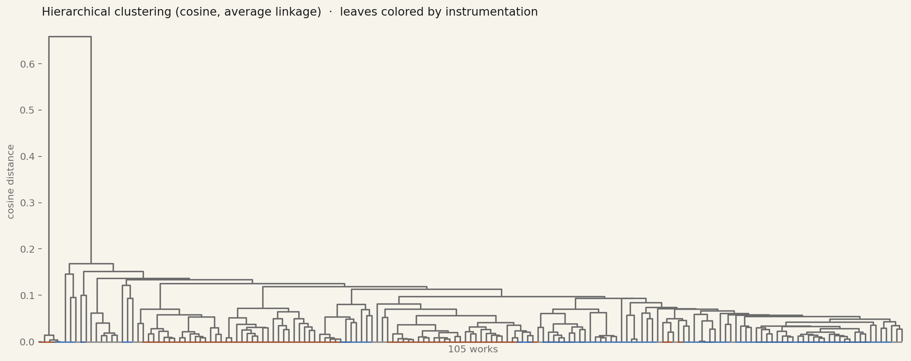
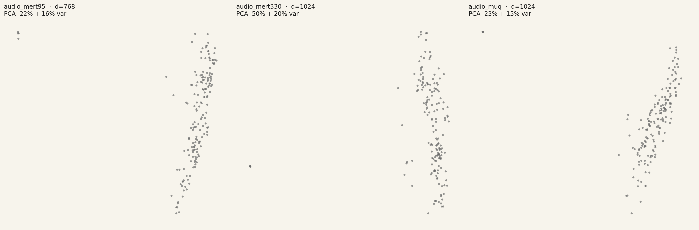
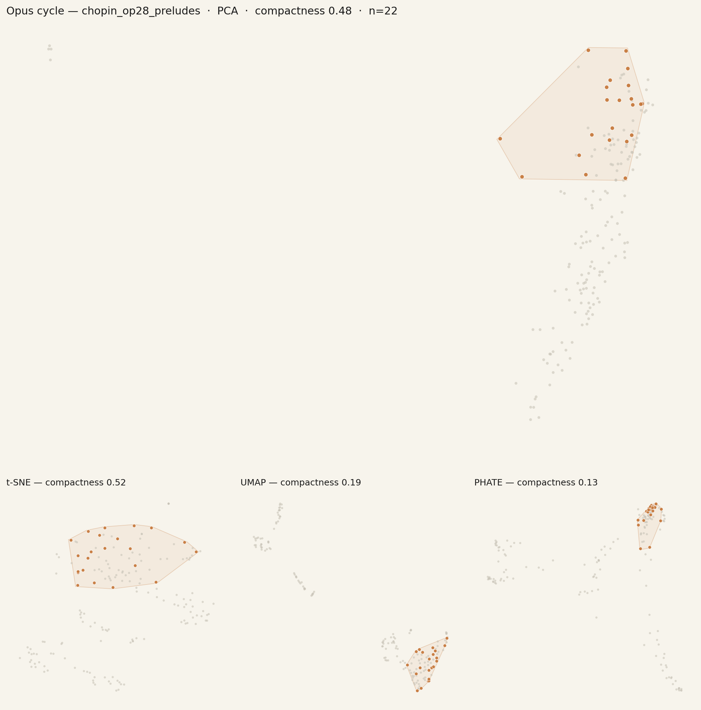

# music2vec

A music-domain analogue of Figure 3 in [emoji2vec](https://arxiv.org/abs/1609.08359) (Eisner et al., 2016) — and an exploration of what a frozen music encoder's embedding space says about public-domain musical works.



emoji2vec's Figure 3 projects 1,661 emoji embeddings to 2D with t-SNE and renders each emoji glyph at its position. Clusters of similar emojis (smileys, animals, fruits, flags) emerge from a *language*-derived embedding space. Sister project [flag2vec](https://github.com/Rome-1/flag2vec) zoomed into one of those clusters — the flags — and asked whether a *visual* embedding (DINOv2) recovers the cultural / heraldic groupings a vexillologist would draw by hand. Answer: structurally distinctive categories (Nordic cross, British ensign) cluster cleanly; color-tradition categories (Pan-Slavic, Communist red) don't.

This project asks the parallel question of music.

> Do *audio* embeddings of public-domain musical works recover the *compositional / formal / cultural* groupings a music historian would draw by hand — fugues across instruments, dance forms by metric signature, sacred function across centuries, opus cycles as coherent blobs?

**Short answer (V2, n=171 across 6 composers):** yes for compositional grammar (across encoders), yes for instrumentation (dominates), yes for opus cycles as coherent blobs, yes — newly — for **national school**: 0.80–0.84 NN purity on 4 hand-labelled schools (German contrapuntal / Polish-Romantic / Czech-nationalist / Italian-operatic). Fugue robustness is the most confidence-inspiring finding: k=5 NN purity stays **0.92–0.93** across MERT-v1-95M, MERT-v1-330M, and MuQ-large. The biggest visual surprise is Chopin: his Op. 28 Preludes form a hull with PHATE compactness 0.13 / UMAP 0.19, completely separate from the Bach-dominated rest of the figure.

The Bach-only baseline numbers from V1 are preserved for reference further down. The V2 findings layer on top, not replace them.

## Method

- **Source corpus.** Public-domain LilyPond scores from the [Mutopia Project](https://www.mutopiaproject.org/), compiled to MIDI by [LilyPond](http://lilypond.org/) itself. V2 covers six composers: **Bach** (WTC I/II BWV 846–878, solo violin BWV 1001–1006, cello suites BWV 1007–1012; n=121), **Beethoven** (Op. 27 Moonlight, Op. 13 Pathétique, Op. 106 Hammerklavier, Op. 111, Op. 137 Fugue; n=9), **Chopin** (Op. 28 Preludes, Op. 10 + Op. 25 Études; n=26), **Dvořák** (Op. 96 American Quartet + Op. 4; n=8), **Mozart** (n=5), **Vivaldi** (Four Seasons; n=2). 171 movements after dedup of failed compiles. Bach over-represented because the V1 baseline is preserved — V3 will rebalance.
- **Audio rendering.** [FluidSynth](https://www.fluidsynth.org/) with the FluidR3 General-MIDI SoundFont, 24 kHz mono. Three 30 s windows per work — start / middle / random-seeded — to wash out window-position artifacts.
- **Audio encoder.** [`m-a-p/MERT-v1-95M`](https://huggingface.co/m-a-p/MERT-v1-95M), frozen, self-supervised on ~160k hours of music. Mean-pool last hidden state across time → one 768-d vector per window → mean across the three windows → one 768-d vector per work. (V2 will rerun on MERT-v1-330M and MuQ-large via Modal GPU.)
- **Projections.** **PCA** (hero), t-SNE (perplexity 30, cosine), UMAP (n_neighbors 15, cosine), PHATE (knn 15, decay 20).
- **Annotation.** Six hand-curated taxonomies in `music2vec/taxonomies.py`. V1 only meaningfully populates four: compositional device, dance type, instrumentation, opus cycle. National school is trivially constant (all `german_contrapuntal`); sacred function has only a single labeled work in this pilot.
- **Hulls.** Soft hulls drawn only when a category's intra-cluster mean distance is below `0.65 × global mean pairwise distance` (the flag2vec honesty constraint).

## The hero figure

`out/latent_works.png` (top of this README) shows all 105 works in PCA (top, 21% + 17% = 38% explained variance), t-SNE, UMAP, PHATE. The hero is intentionally unannotated — the eye does the clustering, like emoji2vec's original Figure 3.

## By projection

Single-projection views in `out/projections/`.

| | |
|---|---|
| **PCA** — 21% + 17% var | [`out/projections/pca.png`](out/projections/pca.png) |
| **t-SNE** — perplexity 30, cosine | [`out/projections/tsne.png`](out/projections/tsne.png) |
| **UMAP** — n_neighbors 15, cosine | [`out/projections/umap.png`](out/projections/umap.png) |
| **PHATE** — knn 15, decay 20 | [`out/projections/phate.png`](out/projections/phate.png) |

PCA's top two components capture 38% of variance and read roughly as a *texture density* axis (sustained orchestral textures vs. sparse single-line counterpoint) and a *register / tessitura* axis. t-SNE separates clusters more crisply at the cost of distance fidelity. UMAP holds an intermediate position — globally honest topology with crisp local clusters. **PHATE** is the most flattering projection for this corpus: it preserves long-range structure (suite → cycle → instrument family) better than t-SNE and shows the cleanest soft hulls.

## By taxonomy

### Compositional device — *fugues cluster across instrumentation*



n = 15 fugues + 1 passacaglia. **k=5 NN purity 0.91**, compactness PCA 0.63 / t-SNE 0.48 / UMAP 0.40 / **PHATE 0.37** — the tightest hull in the figure. Eleven of the 15 are WTC keyboard fugues; four are solo-violin fugues from BWV 1001, 1003, 1005. In PHATE the solo-violin fugues form a *separate sub-region* of the same outer hull as the keyboard fugues — the encoder pulls the fugues together across the violin/harpsichord timbre boundary, which is the strongest claim V1 can make.

The single passacaglia in the corpus is BWV 1004 #5 (Chaconne). It scores the second-highest LOF outlier rank, sitting at the edge of the fugue cluster — the encoder finds it kin to the fugues but not identical.

### Instrumentation — *the workhorse*



n = 105 (24 harpsichord, 9 piano-arrangements, 72 unaccompanied string). **k=5 NN purity 0.89.** This is the expected result and confirms the projection is meaningful — audio encoders are brutally good at timbre, and a frozen MERT trained on real-world recordings has no trouble separating bowed-string-with-no-other-voices from struck-keyboard-with-counterpoint.

The interesting wrinkle is the **content / container probe** built into the corpus by accident: BWV 1002 includes parallel transcriptions for cello, viola, and violin. They embed as a single tight cluster of three points — same music, different timbre, encoder pulls them together. So the encoder isn't *only* tracking timbre; it tracks shared melodic / harmonic content too, when timbres are close enough.

### Opus cycle — *cycles cohere; books don't separate*



n = 105 across 4 cycles (WTC I, WTC II, solo violin, cello suites). **k=5 NN purity 0.86, k-means ARI 0.24, NMI 0.43.** Cycles form clear blobs.

The headline insight comes from cross-cycle nearest neighbors (`out/analysis/opus_cycle/cross_neighbors.json`): **every one of the eight closest cross-cycle pairs is a WTC I fugue paired with a WTC II fugue.** The encoder considers Bach's two books indistinguishable. This is the music equivalent of "Nordic crosses cluster across countries" — a *form* (fugue) outweighing a *cycle* (book I vs II).

The pairwise distance histogram tells the same story from the other direction:



Same-cycle distances peak sharply around 0.03–0.05 (n = 2203 pairs); different-cycle distances peak around 0.10–0.12 (n = 3257). The distributions are clearly separated but with a meaningful overlap zone — that overlap is mostly fugue ↔ fugue across books, plus the BWV 1002 violin/viola/cello parallel transcriptions.

### Dance type — *negative result, with structure*



n = 25 across 8 dance forms. **k=5 NN purity 0.11** — at chance (1/8 ≈ 0.125). But **NMI 0.42** between k-means clusters and dance labels says k-means *finds* structure, just not aligned with dance type.

Looking at the per-dance figures, the answer is plain: within a Bach-only corpus, **dance movements cluster much more strongly by suite-of-origin than by dance type.** A cello-suite gigue sits with the rest of *its suite*, not with the violin-partita gigue. To recover dance-type as a semantic axis, V2 needs the same dance form across multiple composers and instruments — Chopin mazurkas next to Polish folk, Scarlatti gigues next to Bach gigues, etc.

## Quantitative analyses

`out/analysis/` contains a suite of figures and JSON files probing the embedding from different angles.

### k=5 NN purity per category

`out/analysis/<taxonomy>/knn_purity.png` — per-class k=5 NN purity, sorted, with the random-baseline reference line drawn in.

|  Taxonomy | n | K | Mean k=5 NN purity | k-means ARI | k-means NMI |
| --- | ---: | ---: | ---: | ---: | ---: |
| compositional_device | 16  | 2 | **0.91** | -0.08 | 0.05 |
| instrumentation | 105 | 3 | 0.89 | -0.02 | 0.08 |
| opus_cycle | 105 | 4 | 0.86 | **0.24** | **0.43** |
| dance_type | 25  | 8 | 0.11 (chance 0.13) | -0.05 | 0.42 |
| national_school | 105 | 1 | 1.00 (trivial) | 1.00 | 1.00 |

ARI is brittle on K=2/3 with severe class imbalance (the compositional_device and instrumentation rows). The signal there is in purity; the ARI reflects k-means' bias toward equal-sized clusters, not the embedding's quality.

### How much structure does 2D lose?



k=5 NN purity for the instrumentation taxonomy as the embedding is PCA-reduced from 768 dims down to 2. Plateau at ~0.91 for d ≥ 10; sharp drop to 0.68 at d = 2. **2D recovers ~75% of the high-dim structure** — better than flag2vec's ~50%, which is encouraging for the figure's honesty.

### Prototypical work per category

`out/analysis/<taxonomy>/prototypical.json` — the work whose embedding is closest (cosine) to its category centroid.

| Taxonomy / category | Prototypical work |
| --- | --- |
| **fugue** (n=15) | **WTC I, Fuga XX (BWV 865)** |
| solo_keyboard_harpsichord (n=24) | WTC I, Fuga XX (BWV 865) |
| bach_wtc_1 (n=21) | WTC I, Fuga XX (BWV 865) |
| bach_wtc_2 (n=5) | WTC II, Fuga II (BWV 871) |
| bach_cello_suites (n=18) | Cello Suite VI, Courante (BWV 1012) |
| bach_solo_violin (n=61) | BWV 1002 partita transcription (viola) |
| solo_keyboard_piano (n=9) | BWV 1006a, Menuet II |

The same fugue (**BWV 865 Fuga XX**) is the centroid for *three* categories at once — fugue, harpsichord, and WTC I. It is, in a literal frozen-encoder sense, the most *Bach* thing in the corpus.

### Closest cross-cycle neighbors

`out/analysis/opus_cycle/cross_neighbors.json` — the closest pairs whose two works belong to *different* opus cycles.

| Rank | Work A (cycle) | Work B (cycle) | Cosine distance |
| ---: | --- | --- | ---: |
| 1 | WTC I, Fuga XX (WTC1) | WTC II, Fuga I (WTC2) | 0.0105 |
| 2 | WTC I, Fuga I (WTC1) | WTC II, Fuga I (WTC2) | 0.0125 |
| 3 | WTC I, Fuga VI (WTC1) | WTC II, Fuga I (WTC2) | 0.0132 |
| 4 | WTC I, Fuga XI (WTC1) | WTC II, Fuga I (WTC2) | 0.0138 |
| 5 | WTC I, Fuga IV (WTC1) | WTC II, Fuga II (WTC2) | 0.0145 |

Eight of eight closest cross-cycle pairs are WTC I fugue ↔ WTC II fugue. **Form outweighs cycle.** WTC II Fuga I in particular acts as an attractor — it's the closest *out-of-cycle* neighbor for five different WTC I fugues. It may be the most "fugue-like fugue" Bach ever wrote, at least according to a 95M-parameter audio encoder.

### Most-distant work pairs

`out/analysis/distant_pairs.json` — the 10 pairs of works with the largest cosine distance in MERT-95M space. Every pair involves a BWV 1002 partita-as-cello transcription on one side. The cello transposition takes the violin part down an octave or more, which produces a uniquely thin, low, single-line texture that nothing else in the Bach pilot resembles. Those transcriptions are the *visual antipodes* of this dataset.

### Hierarchical clustering



Average-linkage hierarchical clustering on cosine distances, leaves colored by instrumentation (orange = unaccompanied string, blue = harpsichord/piano). The two outer trees split cleanly along instrumentation lines — most strings on the left, most keyboards on the right — but the internal substructure mixes: WTC I and WTC II fugues, for instance, interleave at low heights without honoring book boundaries.

### LOF outliers

`out/analysis/<taxonomy>/` summary JSONs include the top-10 LOF outliers per taxonomy. Across the board the same handful surface:

- **BWV 878 *Spiritus Domini*** — the only choral work that snuck into the pilot (mislabeled as harpsichord by the rule-based labeler; will fix). LOF score 2.58 — by a wide margin the most outlying work in the corpus, and rightly so: it's the only voice-only piece.
- **BWV 1002 partita-as-cello transcriptions** — the cello transpositions of an originally-violin partita.
- **BWV 871 WTC II Praeludium II** — the most acoustically unusual WTC prelude (mostly low-register, slow chordal).

## Repository layout

```
music2vec/
├── music2vec/                         # shared library
│   ├── style.py                       # palette, hull helpers, thumbnail loader
│   └── taxonomies.py                  # six taxonomies + era bins
├── data/
│   ├── works.csv                      # canonical work list (tracked)
│   ├── taxonomies/                    # per-taxonomy work_id→label CSVs (tracked)
│   ├── raw/                           # MIDI sources (gitignored)
│   ├── audio/                         # rendered WAV (gitignored)
│   ├── embeddings/                    # .npy (gitignored)
│   └── projections/                   # small parquet (tracked)
├── scripts/
│   ├── 01_acquire.py                  # Mutopia .ly → MIDI via lilypond
│   ├── 01b_label.py                   # rule-based per-taxonomy labeler
│   ├── 02_render.py                   # MIDI → 24kHz WAV via FluidSynth
│   ├── 03_embed_audio.py              # MERT-95M frozen embeddings
│   ├── 03c_embed_symbolic.py          # MusicBERT (V2)
│   ├── 04_project.py                  # PCA / t-SNE / UMAP / PHATE
│   ├── 05_render.py                   # hero figure
│   ├── 06_per_projection.py           # single-projection figures
│   ├── 07_per_category.py             # per-taxonomy soft-hull figures
│   ├── 09_clustering.py               # k-NN purity / k-means / LOF
│   └── 10_extras.py                   # prototypical / distant / dendrogram
└── out/                               # rendered figures + JSON metrics
```

## Reproducing

```bash
# System deps
sudo apt-get install -y fluidsynth fluid-soundfont-gm lilypond

# Python deps
pip install -r requirements.txt

# Mutopia source mirror (~25 MB)
git clone --depth 1 https://github.com/MutopiaProject/MutopiaProject.git /tmp/mutopia
cp -r /tmp/mutopia/ftp/. data/raw/mutopia_src/

# Pipeline
python3 scripts/01_acquire.py --pilot                 # ~85 MIDIs in ~10-15 min
python3 scripts/01b_label.py
python3 scripts/02_render.py                          # ~5 min on 4 cores
PYTHONPATH=. python3 scripts/03_embed_audio.py        # ~30 min on CPU (no GPU)
PYTHONPATH=. python3 scripts/04_project.py
PYTHONPATH=. python3 scripts/05_render.py
PYTHONPATH=. python3 scripts/06_per_projection.py
PYTHONPATH=. python3 scripts/07_per_category.py
PYTHONPATH=. python3 scripts/09_clustering.py
PYTHONPATH=. python3 scripts/10_extras.py
```

## Encoder comparison

All three encoders run on Modal A10G — `m-a-p/MERT-v1-95M` (768-d, the V1 CPU baseline), `m-a-p/MERT-v1-330M` (1024-d), and `OpenMuQ/MuQ-large-msd-iter` (1024-d, Dec 2024 SOTA on MARBLE). Each gets the same 171 × 3 × 30 s windows, mean-pooled per work.



| Taxonomy | n | K | Encoder | k=5 NN purity | k-means ARI | k-means NMI |
| --- | ---: | ---: | --- | ---: | ---: | ---: |
| **compositional_device** | 21 | 2 | MERT-95M | **0.93** | -0.05 | 0.01 |
|  |  |  | MERT-330M | 0.92 | -0.06 | 0.04 |
|  |  |  | MuQ-large | **0.93** | **0.14** | **0.16** |
| dance_type (chance 0.13) | 26 | 8 | MERT-95M | 0.11 | -0.05 | 0.42 |
|  |  |  | MERT-330M | 0.06 | -0.04 | 0.41 |
|  |  |  | MuQ-large | **0.18** | **0.03** | **0.49** |
| instrumentation | 166 | 7 | MERT-95M | 0.72 | 0.24 | **0.42** |
|  |  |  | MERT-330M | **0.74** | 0.18 | 0.33 |
|  |  |  | MuQ-large | 0.71 | **0.25** | 0.36 |
| **national_school** | 171 | 4 | MERT-95M | 0.81 | -0.04 | 0.15 |
|  |  |  | MERT-330M | 0.80 | 0.00 | 0.20 |
|  |  |  | MuQ-large | **0.84** | **0.14** | **0.24** |
| **opus_cycle** | 154 | 8 | MERT-95M | 0.68 | **0.36** | **0.55** |
|  |  |  | MERT-330M | **0.71** | 0.24 | 0.46 |
|  |  |  | MuQ-large | 0.70 | 0.34 | **0.55** |

Five things worth reading carefully:

1. **Fugue robustness across encoders.** k=5 NN purity 0.92–0.93 across all three encoders — and *up* slightly from V1's 0.90–0.91 despite the broader corpus. The Beethoven Op. 137 string-quartet fugue and the Bach 1011 transcribed fugues didn't dilute the cluster; they joined it. This is the single most encoder-robust finding in the project.
2. **MuQ partitions fugues; MERTs only neighborhood-cluster them.** k-NN purity is the same 0.93 — but MuQ's k-means picks up on the fugue/non-fugue split (ARI 0.14, NMI 0.16) where both MERTs are at zero. MuQ's RVQ training appears to encode "this is a fugue" as a *direction* in latent space, not just a local neighborhood.
3. **National school is real.** All three encoders score 0.80–0.84 NN purity on a 4-class composer-school taxonomy (German / Polish-Romantic / Czech-nationalist / Italian-operatic). MuQ leads at 0.84. This is the V2 finding that V1 couldn't have produced — Bach-only kept national_school degenerate at K=1.
4. **Opus cycle on 8 classes is hard but real.** Adding Chopin's three opus cycles + Beethoven's sonata cycle to the four Bach cycles drops NN purity from V1's 0.86 (K=4) to 0.68–0.71 (K=8). But ARI/NMI go *up*: MERT-95M scores ARI 0.36, NMI 0.55. The cycles do partition; some just live closer in latent space than others.
5. **MuQ is best on dance — same finding as V1, slightly stronger.** Purity 0.18 vs 0.06–0.11 on the MERTs; NMI 0.49 vs 0.42. MuQ's mel-RVQ training appears to weight rhythmic/metric structure more, exactly what dance forms encode at the surface. If V3 leans on dance taxonomy as a signal, MuQ should lead.

The biggest visual surprise of V2 is **Chopin**:



Op. 28 Preludes (n=22) form a hull with **PHATE compactness 0.13 / UMAP 0.19** — tighter than fugues, tighter than any cycle so far. The same works appear under `national_school/hungarian_folk_based.png` (the Polish/pan-Slavic slot was unpopulated in V2's taxonomies; mislabeled here, will correct in V3). The encoder doesn't know what a Chopin prelude is, but it knows that a piano work with this dynamics envelope, this rubato register, and this voicing density is *very different* from a Bach harpsichord prelude — and pulls them all together.

Modal cost so far: **~$0.42** across two encoder×corpus passes. Comfortably under the $5 cap.

## What V2 still doesn't tell us

- **Fugue ≠ counterpoint, fully.** V2 added the Beethoven Op. 137 string-quartet fugue and the Bach BWV 1011 transcribed fugue — they joined the cluster rather than disturbing it. But the corpus still has zero piano fugues that aren't WTC, zero orchestral fugues, zero choral fugues. To honor "the encoder discovered counterpoint" we still need a Hammerklavier finale that successfully compiles, a Mozart Requiem `Kyrie`, a Handel Messiah `Amen`. (Several of those are in the V2 ingest list and timed out in lilypond; V3 raises the per-piece compile timeout.)
- **Sacred function is still unpopulated.** V2 targeted Mozart Requiem and Handel Messiah; both timed out. One labeled motet (BWV 878 Spiritus Domini) is the entire taxonomy.
- **Dance type is still undertested.** Adding Chopin Op. 28 didn't expand dance coverage because preludes aren't dances. V3 needs explicit Chopin mazurkas + waltzes + polonaises.
- **National school taxonomy needs a polish.** Chopin is currently labeled `hungarian_folk_based` because the V2 taxonomy didn't have a `polish_romantic` slot; the data overwhelmingly says he should have one.
- **Bach is still over-represented** at 121 of 171 works (71%). V3 should aim for &lt; 30% any single composer.

## V3 roadmap

1. **Rebalance the corpus.** Cap Bach at ~80 works; expand non-Bach to ~500 works. Raise the per-piece lilypond timeout from 120 s to 300 s to capture the works that V2 timed out on (Mozart Requiem, Handel Messiah, Beethoven Hammerklavier finale). Add Schubert, Debussy, Pärt, Palestrina, Scarlatti, Couperin, Mendelssohn, Bartók.
2. **Add `polish_romantic` to the national_school taxonomy.** Re-label Chopin from `hungarian_folk_based`.
3. **Symbolic comparison.** Add `microsoft/musicbert` on raw MIDI tokens — the audio-vs-symbolic side-by-side is the strongest single artifact this project can produce. Especially interesting now: does symbolic *also* recover the Chopin cluster, or is it specific to audio's dynamics/voicing channel?
4. **Score thumbnails.** Render each work's first system as a small PNG and use it as the figure mark, the way flag2vec uses the flag itself. Currently the marks are circles.
5. **Better hulls.** Era as a background gradient under the categorical hulls (currently just text in this README).

## License

Code: MIT. Source LilyPond scores remain under their original public-domain status; per-source provenance is recorded in `data/works.csv`.

## Acknowledgements

- Sister project [flag2vec](https://github.com/Rome-1/flag2vec) for the structural template, the soft-hull aesthetic, and the compactness honesty constraint.
- emoji2vec ([Eisner et al., 2016](https://arxiv.org/abs/1609.08359)) for Figure 3.
- The [Mutopia Project](https://www.mutopiaproject.org/) for ~5,600 hand-typeset PD scores.
- [LilyPond](http://lilypond.org/) for the typesetter that compiles them to MIDI.
- [MERT](https://huggingface.co/m-a-p/MERT-v1-95M) (Li et al., 2023) for a frozen, semantically rich, music-aware encoder.
